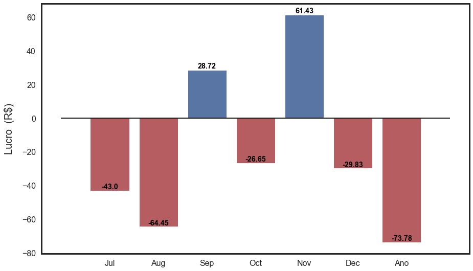

# Controle B3

  Notebook para o controle de compras e vendas de ações.

  Este notebook foi feito para ser usado no [Colab][colab] do google,
pois usa o google finances e as planilhas do google spreadsheets.
  
**Como usar:**

  É necessário baixar a planilha com as informações sobre compras e vendas de ações do site da [B3][B3]. Para isso, basta entrar no [CEI][CEI], que é o Canal Eletrônico do Investidor. Este site é gerenciado pela própria [B3][B3] e contém informações sobre seus títulos no tesouro direto, ações, CDB e etc.
   Depois de acessar a página do [CEI][CEI] é só ir em: Extratos e informativos/Negociações de Ativos. Você deve ver a opção de baixar a planilha por excel nesta página.

**TODO:**
  - Explicar como são adicionadas as planilhas no google.

**Utilidades:**

  - Cria a carteira de ações no google spreasheet, onde podemos acompanhar os
  valores das ações com delay de 20 min.
  
    
  - Mostra o lucro por mês.
  
  
  - Mostra o lucro da carteira atual.
  
  
  
  
  - Ajuda na declaração do imposto de renda. 

[CEI]: https://cei.b3.com.br/CEI_Responsivo/login.aspx
[B3]: http://www.b3.com.br/pt_br/
[colab]: https://colab.research.google.com/notebooks/welcome.ipynb
